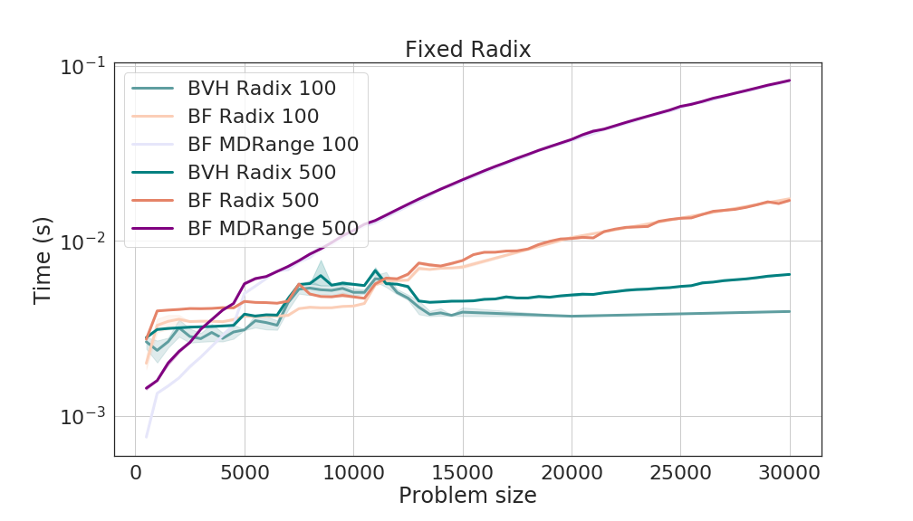

# Performance

Runs on Summit. For each parameter set, there are 10 cold start runs out of a total of 100 runs. Bash script to submit the code:
```bash
#BSUB -W 0:30
#BSUB -nnodes 1
#BSUB -J arborx_brute_force
#BSUB -o arborx_bf%J.out
#BSUB -e arborx_bf%J.err

for i in {1..60}; do
  cnt=$(( $i * 500 ))
  echo "Problem size $cnt"
  for _ in {1..10}; do
    jsrun -n1 -a1 -c7 -g1 -r1 ./examples/brute_force/ArborX_BruteForce.exe -p $cnt -q $cnt -r 10
  done
done
```

## Collisions between spheres and points

Problem size is represented by the number of primitives (which is equal to the number of predicates).

The example code identifies collisions between points and shperes. The sphere can have different radix (the following example shows linear radix).

```c++
template <> struct ArborX::AccessTraits<Dummy, ArborX::PrimitivesTag> {
  using memory_space = MemorySpace;
  using size_type = typename MemorySpace::size_type;
  static KOKKOS_FUNCTION size_type size(Dummy const &d) { return d.count; }
  static KOKKOS_FUNCTION Point get(Dummy const &, size_type i) {
    return {{(float)i, (float)i, (float)i}};
  }
};

template <> struct ArborX::AccessTraits<Dummy, ArborX::PredicatesTag> {
  using memory_space = MemorySpace;
  using size_type = typename MemorySpace::size_type;
  static KOKKOS_FUNCTION size_type size(Dummy const &d) { return d.count; }
  static KOKKOS_FUNCTION auto get(Dummy const &, size_type i) {
    return attach(intersects(Sphere{{{(float)i, (float)i, (float)i}},
                                    (float) i}),
                  i);
  }
};
```

The collision ratio defines the amount of detected collisions:
```c++
collision_ratio = (float)(indices.extent(0)) / (nprimitives * nqueries));
```

### Varying the problem size

Linear increasing radix keeps the collition ratio to 0.47 regardless of the problem size and the logarithmic increase radix has collision rations of less than to 0.01


### Variying the problem size with a fix radix

The amount of collisions decrease as the problem size increases.



### Varying the amount of collisions

Keeping the problem size fixed.


## Measure time

For BVH
```c++
      Kokkos::Timer timer;
      ArborX::BoundingVolumeHierarchy<MemorySpace> bvh{space, primitives};

      Kokkos::View<int *, ExecutionSpace> indices("indices_ref", 0);
      Kokkos::View<int *, ExecutionSpace> offset("offset_ref", 0);
      bvh.query(
          space, predicates, ArborX::Details::DefaultCallback{},
          indices, offset,
          ArborX::Experimental::TraversalPolicy{}.setPredicateSorting(true));

      double time = timer.seconds();
      printf("Time BVH: %lf\n", time);
```

For the brute force slgorithm
```c++
      Kokkos::Timer timer;
      ArborX::BruteForce<MemorySpace> brute{space, primitives};

      Kokkos::View<int *, ExecutionSpace> indices("indices", 0);
      Kokkos::View<int *, ExecutionSpace> offset("offset", 0);
      brute.query(space, predicates,
                  ArborX::Details::DefaultCallback{}, indices,
                  offset);

      double time = timer.seconds();
      printf("Time BF: %lf\n", time);
```

## Install ArborX

Prerequisite

```bash
module load cmake
module load gcc/5.4.0
module load cuda
```

Install Kokkos

```bash
KOKKOS_INSTALL_DIR=/ccs/home/againaru/kokkos/install_new
OPTIONS=(
    -D CMAKE_INSTALL_PREFIX="${KOKKOS_INSTALL_DIR}"
    -D Kokkos_ENABLE_SERIAL=ON
    -D Kokkos_ENABLE_OPENMP=ON
    -D Kokkos_ENABLE_CUDA=ON
        -D Kokkos_ENABLE_CUDA_LAMBDA=ON
    -D Kokkos_ARCH_POWER9=ON
    -D Kokkos_ARCH_VOLTA70=ON
    )
cmake "${OPTIONS[@]}" ../kokkos
make -j4
make intall -j4
```

Install ArborX

```bash
cmake -D CMAKE_INSTALL_PREFIX=/ccs/home/againaru/arborx/ArborX/install -D ARBORX_ENABLE_MPI=ON -D CMAKE_PREFIX_PATH=/ccs/home/againaru/kokkos/install_new -D CMAKE_CXX_COMPILER=/ccs/home/againaru/kokkos/install_new/bin/nvcc_wrapper -D CMAKE_CXX_EXTENSIONS=OFF ..

To run the exampes an additional parameter is required
-D ARBORX_ENABLE_EXAMPLES=ON

make -j4
```
